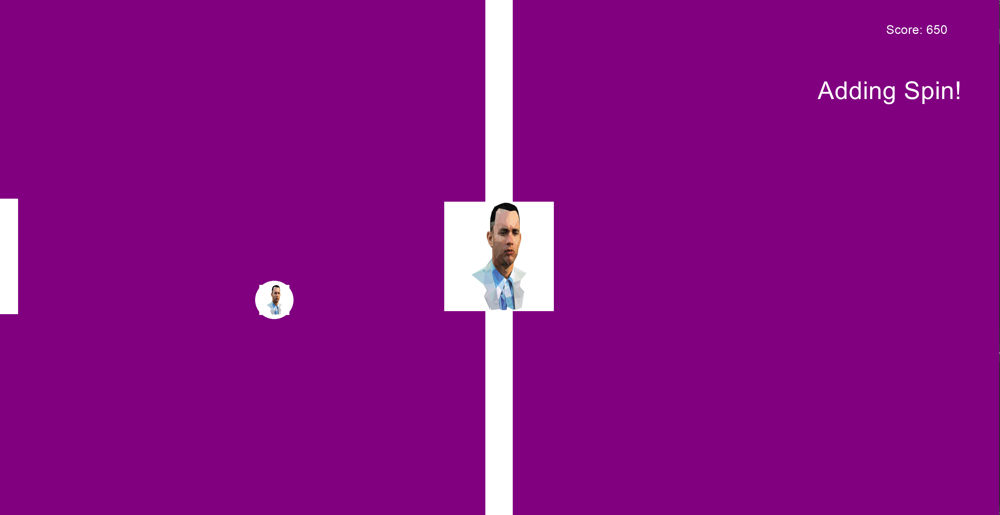

# Gump Pong

### A game inspired by Forrest Gump's insane ping pong skills.

Step into the Forrest Gump universe and increase your pong skills.

## Dependencies 

- cmake
- cinder
- Visual Studio 2015

## Start

- download [Cinder](https://libcinder.org/download) on your local machine
- clone this repository one level below the Cinder library.
- run the executable file in your IDE

## Controls

| Key       | Action                                                      |
|---------- |-------------------------------------------------------------|
| `up-arrow`       | Move the paddle up                                          |
| `down-arrow`       | Move the paddle down                                           |
| `SPACE` | Add a pong ball to the table                                                        |

#### Remember, the more pong balls you add to the table, the higher your score can get!